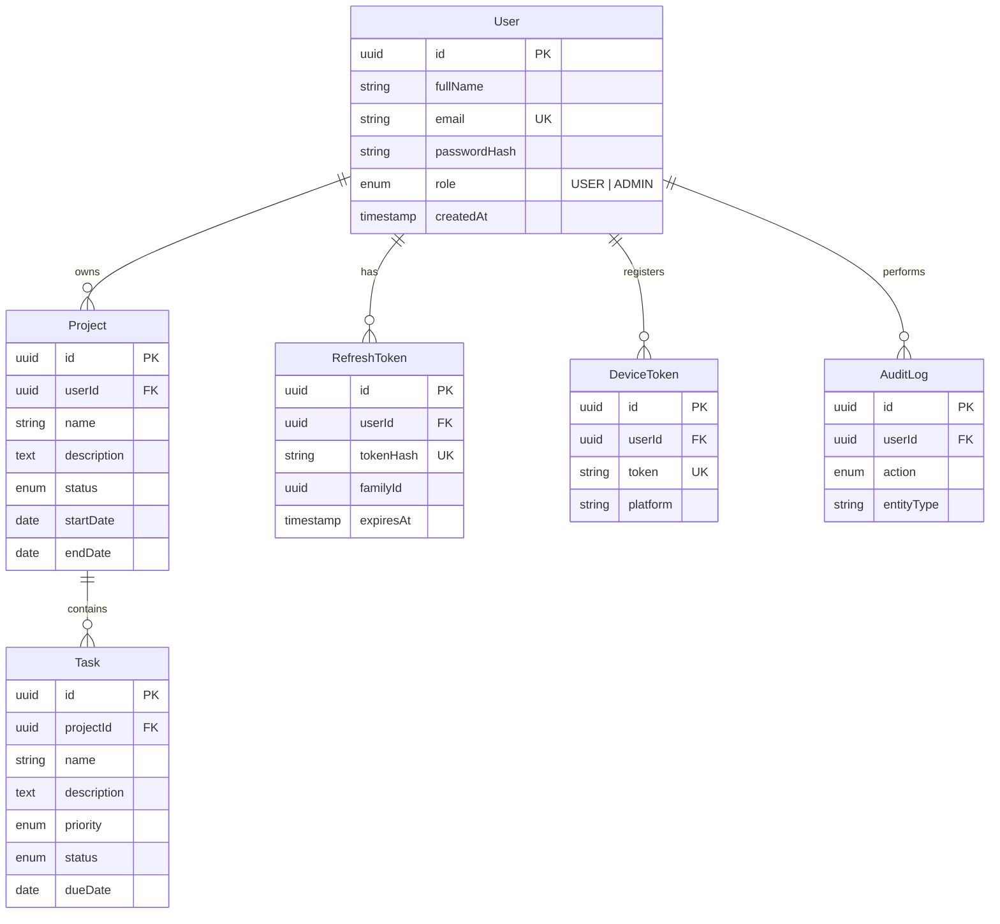

# Database Schema & ER Diagram

Our system utilizes PostgreSQL, managed by Prisma ORM. The database is highly normalized to ensure data integrity and robust security (ownership enforcement).

## Entity Relationship Diagram (ERD)

## Tables Overview

1. **User (`users`)**
   - Core identity model containing `email` and `passwordHash`.
   - Supports RBAC through the `role` enum (`USER`, `ADMIN`).

2. **Project (`projects`)**
   - Belongs to a `User`.
   - Represents a high-level goal or bucket of tasks.
   - Enforces strict tenancy via `userId` foreign key.

3. **Task (`tasks`)**
   - Belongs to a `Project`.
   - Represents individual actionable items.
   - Includes `priority` (`LOW`, `MEDIUM`, `HIGH`) and `status` (`PENDING`, `IN_PROGRESS`, `COMPLETED`).

4. **RefreshToken (`refresh_tokens`)**
   - Stores hashed refresh tokens for secure JWT rotation.
   - Supports token family tracking (`familyId`) to revoke all tokens in a compromised chain.

5. **DeviceToken (`device_tokens`)**
   - Stores FCM registration tokens for Push Notifications (e.g. Tasks Due Tomorrow).

6. **AuditLog (`audit_logs`)**
   - Immutable ledger tracking critical events (`CREATE`, `UPDATE`, `DELETE`, `LOGIN`, `LOGOUT`).
